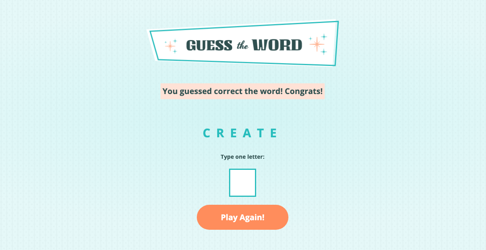

# Guess The Word

## Description:

This is a simple word guessing game built with HTML, CSS and vanilla JavaScript.

The word data is retrieved using an async fetch request.

This was a project I completed while attending the [Skillcrush Break Into Tech Frontend Development Track](https://skillcrush.com/break-into-tech-blueprint/). There are a lot of comments in the script.js file as I was using them as a teaching tool to document all my steps.

[View Project](https://heidifryzell.com/guess-the-word/)
